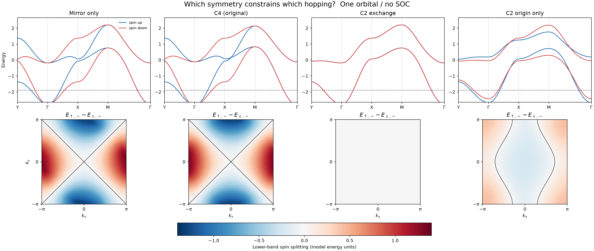
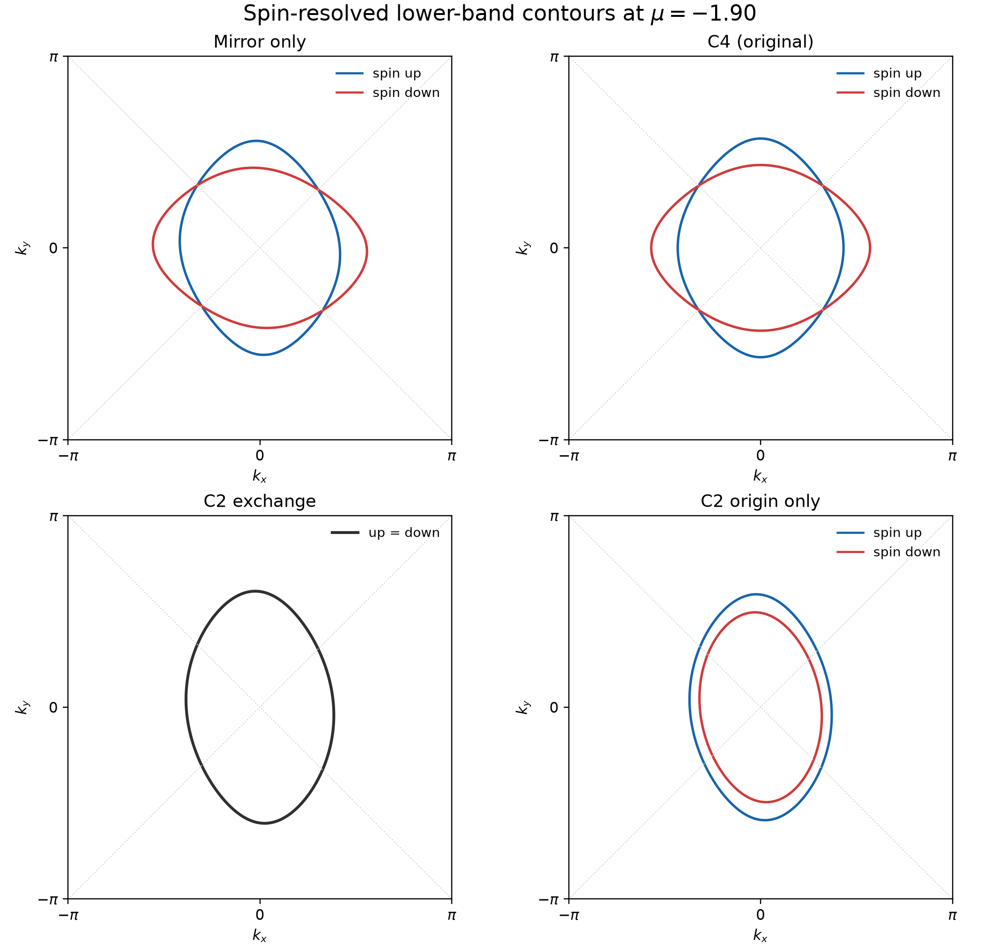

# 从两个磁性格点出发：交错磁的对称性、hopping、能带与费米面

同一个晶胞里有一个磁矩向上的 A 格点、一个磁矩向下的 B 格点，净磁矩相互抵消。这样的体系会像普通反铁磁一样，在每个动量处都保持自旋简并吗？**不一定。**关键不是只看磁矩之和，而是看哪一种空间操作把 A 与 B 联系起来，以及它如何约束电子的跃迁参数。

这篇教程从一个二维方格、每格点一个有效 $d$ 轨道的模型开始，依次建立实空间 hopping、Bloch 哈密顿量、对称性与参数的关系，再用 $Y\to\Gamma\to X\to M\to\Gamma$ 能带和自旋分辨费米面验证。全文不考虑自旋轨道耦合（SOC）；参数只是演示数值，不拟合特定材料。与交错磁分类有关的背景可参考 [Šmejkal、Sinova、Jungwirth，*Physical Review X* **12**, 040501 (2022)](https://doi.org/10.1103/PhysRevX.12.040501)。本文的四组图是下述玩具模型自行计算的结果。

## 一、晶格：先把 A、B 放在哪里说清楚

令晶格常数 $a=1$，方格 Bravais 晶格矢量为 $\mathbf a_1=(1,0)$、$\mathbf a_2=(0,1)$。每个晶胞中的两个磁性格点坐标是

$$
\boldsymbol\rho_A=(0,\tfrac12),\qquad
\boldsymbol\rho_B=(\tfrac12,0).
$$

A 的局域磁矩沿 $+z$，B 沿 $-z$。每个格点仍保留电子的上、下两种自旋态，所以一个 $\mathbf k$ 点的基底有四个分量：

$$
\Psi_{\mathbf k}=
(c_{A\mathbf k\uparrow},c_{B\mathbf k\uparrow},
 c_{A\mathbf k\downarrow},c_{B\mathbf k\downarrow})^T.
$$

下面的 $\tau_i$ 作用在 A/B 子格空间；$\sigma_i$ 作用在电子自旋空间。无 SOC 时两个自旋块彼此不混合。所谓 A↑、B↓，是说 A 上的自旋上电子、B 上的自旋下电子分别因局域交换场而能量较低，**不是把另两种电子自旋态从基底中删除**。

有一个容易漏掉的结构前提：**仅画出这两个磁性格点**，位移 $(1/2,-1/2)$ 看起来也能交换 A/B。如果它真是完整晶体的平移对称，A/B 的局域环境就不能有本文设定的不同 hopping，模型也不会成为这里的交错磁。实际材料需要配体、非磁原子或结构畸变来破坏这个半平移，同时保留所讨论的旋转/镜面关系；在这个有效模型中，这些未显式画出的环境影响由 A/B 跃迁参数的不同来编码。


*图 1｜蓝点为 A↑，红点为 B↓。蓝、红线分别举例显示 A–A、B–B 沿 $x/y$ 的 hopping；绿、紫线显示两类 A–B 对角键。虚线是第一栏的 $M_{xy}$ 镜面，星号标出其余各栏的旋转中心。数值是模型单位。*

## 二、模型：从每条键写到动量空间

先允许同类格点的 hopping 独立：A–A 沿 $x,y$ 分别为 $t_{Ax},t_{Ay}$，B–B 分别为 $t_{Bx},t_{By}$。A 到相邻 B 有四条位移为 $(\pm\tfrac12,\pm\tfrac12)$ 的键。把斜率为正、负的两组分别记为 $t_+$、$t_-$。约定每条实 hopping 在哈密顿量中写作 $-t(c_i^\dagger c_j+\mathrm{h.c.})$。

格点上的交错交换场写作 $-\Delta\tau_z\sigma_z$，其中 $\Delta>0$。于是 A 上自旋上的交换能为 $-\Delta$，B 上自旋下的交换能也为 $-\Delta$，而另外两种组合为 $+\Delta$。

傅里叶变换给出两个子格各自的非磁色散与子格间混合项：

$$
\begin{aligned}
\epsilon_A(\mathbf k)&=-2t_{Ax}\cos k_x-2t_{Ay}\cos k_y,\\
\epsilon_B(\mathbf k)&=-2t_{Bx}\cos k_x-2t_{By}\cos k_y,\\
g(\mathbf k)&=-2t_+\cos\frac{k_x+k_y}{2}
               -2t_-\cos\frac{k_x-k_y}{2}.
\end{aligned}
$$

最后一式来自四条 A–B 键的相位和。例如斜率为正的一对贡献 $-t_+[e^{i(k_x+k_y)/2}+e^{-i(k_x+k_y)/2}]$，即第一项。定义平均与差值

$$
\epsilon_0=(\epsilon_A+\epsilon_B)/2,\qquad
d=(\epsilon_A-\epsilon_B)/2.
$$

对自旋 $s=+1$（上）或 $s=-1$（下），$2\times2$ 的 Bloch 哈密顿量及能量是

$$
\boxed{H_s(\mathbf k)=\epsilon_0\tau_0+g\tau_x+(d-s\Delta)\tau_z,}
$$

$$
\boxed{E_{s,\pm}(\mathbf k)=\epsilon_0\pm
\sqrt{g^2+(d-s\Delta)^2}.}
$$

在上述四维基底中，完整矩阵是

$$
H(\mathbf k)=
\begin{pmatrix}
\epsilon_0+d-\Delta&g&0&0\\
g&\epsilon_0-d+\Delta&0&0\\
0&0&\epsilon_0+d+\Delta&g\\
0&0&g&\epsilon_0-d-\Delta
\end{pmatrix}.
$$

这个公式已经指出关键条件：$\Delta\ne0$ 只保证存在反向的**局域交换场**；若 $d=0$，则根号中的 $(d-\Delta)^2$ 与 $(d+\Delta)^2$ 相同，故上下自旋能带仍处处简并。要看见非相对论自旋劈裂，还需要 A/B 的非磁色散在同一动量处不同，并以合适的对称方式互换。

## 三、对称操作怎样约束 hopping？

无 SOC 的自旋群记号 $[C_2^{\rm spin}\parallel R]$ 中，右边 $R$ 只变换轨道和空间位置，左边 $C_2^{\rm spin}$ 负责把自旋上、下互换；它们是两个操作。若 $R$ 把 A↑ 映到 B 的位置，还需左边的自旋翻转才能回到 B↓。检验完整哈密顿量的式子是

$$
U_RH(\mathbf k)U_R^\dagger=H(R\mathbf k),
\qquad U_R=\tau_x\sigma_x
$$

（这里采用包含格点坐标的 Bloch 基底；$\sigma_x$ 与真正的自旋 $\pi$ 旋转矩阵只差不影响该等式的整体相位。）**仅画出一个方形外框，不足以证明磁性哈密顿量具有某项对称。**

### 1. 镜面 $M_{xy}$：A 的 $x$ 键要等于 B 的 $y$ 键

$M_{xy}:(x,y)\mapsto(y,x)$ 交换 A、B，也交换 $x,y$，因此

$$
t_{Bx}=t_{Ay}\equiv t_y,\qquad
t_{By}=t_{Ax}\equiv t_x.
$$

两类对角键各自映回同类，故**只要求镜面时** $t_+$ 与 $t_-$ 可以不同。此时

$$
\epsilon_0=-(t_x+t_y)(\cos k_x+\cos k_y),\qquad
d=-(t_x-t_y)(\cos k_x-\cos k_y).
$$

$d(k_y,k_x)=-d(k_x,k_y)$，而 $\epsilon_0$ 与 $g$ 在交换 $k_x,k_y$ 后不变，故

$$
E_{\uparrow,\pm}(k_x,k_y)
=E_{\downarrow,\pm}(k_y,k_x).
$$

这给出 $X=(\pi,0)$ 与 $Y=(0,\pi)$ 的自旋劈裂反号关系；在 $k_x=k_y$ 上，上下自旋简并。对这个最低阶余弦模型，$k_x=-k_y$ 上也有 $d=0$，但后一条节点不能只由单个 $M_{xy}$ 对任意更复杂模型推出。

### 2. 四重旋转 $C_{4z}$：还要让两类 A–B 对角键相等

绕原点的 $C_{4z}:(x,y)\mapsto(-y,x)$ 也交换 A/B，给同类键的约束**与上面的镜面完全一样**：$t_{Bx}=t_{Ay}$、$t_{By}=t_{Ax}$。区别是它把 $t_+$ 型 A–B 键转成 $t_-$ 型，因此必须再加

$$
t_+=t_-\equiv t_{AB},\qquad
g=-4t_{AB}\cos(k_x/2)\cos(k_y/2).
$$

这正是本文的“原始 $C_4$”参数组。注意：若只写最近邻 $t_x,t_y$，并让两类对角键本来就相等，**同一个哈密顿量会同时具有镜面和 $C_4$ 的联合自旋对称**，不能把它归为“只有镜面”。把 $t_+$ 与 $t_-$ 调得不相等，才得到一个保留 $M_{xy}$、打破 $C_{4z}$ 的清楚对照。

### 3. 二重旋转 $C_2$：不先指定中心，就没有唯一的参数答案

绕原点的 $C_{2z}^{O}:(x,y)\mapsto(-x,-y)$ 将 A 映回 A、B 映回 B。它**不需要**额外自旋翻转，也不强制 A 的 $x$ hopping 与 B 的 $y$ hopping 相等；四个同类键参数可以独立。因此普通 $C_{2z}^{O}$ 本身不能保证上面的 $X/Y$ 交错关系。第四组只是展示这种“约束不够”的对照：尽管人为指定等大反向的局域交换场，不对称的电子色散也不保证固定填充下的总电子磁矩严格补偿，不能直接把它称为交错磁材料。

若改绕 $O'=(1/4,1/4)$ 转 $180^\circ$，$C_{2z}^{O'}$ 会交换 A、B，但 $x$ 键仍变成 $x$ 键，$y$ 键仍变成 $y$ 键。因此联合自旋翻转操作要求

$$
t_{Bx}=t_{Ax},\qquad t_{By}=t_{Ay}.
$$

对本教程的**二维、实 hopping** 模型，这使 $d(\mathbf k)=0$，上下自旋能带在每个 $\mathbf k$ 处重合。它与能产生交错劈裂的镜面/$C_4$ 参数关系恰好不同。但“$C_2$ 一概不能产生交错磁”是错误的：面内轴的 $C_2$ 会以不同方式变换二维动量，也可能联系反向自旋子格并允许劈裂。此处的简并结论仅针对图 1 中指定中心的 $C_{2z}$ 和本模型；三维材料也须重新检查 $k_z$ 与完整结构。

四组示例统一取 $\Delta=0.65$，参数如下：

| 案例 | $t_{Ax}$ | $t_{Ay}$ | $t_{Bx}$ | $t_{By}$ | $t_+$ | $t_-$ |
|---|---:|---:|---:|---:|---:|---:|
| 只有所需的 $M_{xy}$ | 0.55 | 0.19 | 0.19 | 0.55 | 0.36 | 0.20 |
| $C_{4z}$ 原始模型 | 0.55 | 0.19 | 0.19 | 0.55 | 0.30 | 0.30 |
| 交换 A/B 的中点 $C_{2z}$ | 0.55 | 0.19 | 0.55 | 0.19 | 0.36 | 0.20 |
| 不交换 A/B 的原点 $C_{2z}$ 示例 | 0.55 | 0.19 | 0.40 | 0.10 | 0.36 | 0.20 |

## 四、能带：为什么一定要画 $Y$–$\Gamma$–$X$？

第一布里渊区的点为 $\Gamma=(0,0)$、$X=(\pi,0)$、$Y=(0,\pi)$、$M=(\pi,\pi)$。沿 $Y\to\Gamma\to X\to M\to\Gamma$ 作图，可以把 $k_y$ 与 $k_x$ 两个方向的能带放在一条连续路径上，直接看到 $X/Y$ 的自旋次序交换。图中的蓝、红曲线分别来自 $s=+1,-1$；一条自旋曲线并不代表单个格点，而是相应 $2\times2$ 自旋块的两条杂化能带。



*图 2｜上排为指定高对称路径的能带；下排为整个二维动量区中下带的 $\Delta E_-=E_{\uparrow,-}-E_{\downarrow,-}$。红、蓝表示劈裂相反符号，不是局域磁矩朝向的实空间图。第三栏因自旋简并而几乎全白。*

前两栏在 $X$ 的下带自旋劈裂为 $+1.30$，在 $Y$ 为 $-1.30$；沿 $\Gamma$–$M$ 两自旋重合。它们的劈裂呈 $d$ 波型，因为当 $|d|$ 相对带间分裂较小时，

$$
\Delta E_-(\mathbf k)
\simeq\frac{2\Delta\,d(\mathbf k)}{\sqrt{g(\mathbf k)^2+\Delta^2}}
\propto \cos k_x-\cos k_y.
$$

第三栏的 $\Delta E_-=0$；第四栏可以有自旋劈裂，但仅有普通原点 $C_2$ 并不强制其满足镜面或 $C_4$ 的自旋伙伴关系。图形某些局部相似之处不能代替哈密顿量的对称性检验。

## 五、费米面：固定化学势后看什么？

二维体系的“费米面”在图上是等能**线**。这里固定示意化学势 $\mu=-1.90$，只取两条下能带，分别解

$$
E_{\uparrow,-}(k_x,k_y)=\mu,\qquad
E_{\downarrow,-}(k_x,k_y)=\mu.
$$



*图 3｜蓝色为自旋上，红色为自旋下；中点 $C_{2z}$ 案例两者完全重叠，故画成一条黑线。灰色虚线标出两条动量对角线。四幅图使用同一个 $\mu=-1.90$，便于比较。*

前两栏的两条自旋轮廓在 $M_{xy}$ 下相互交换；$C_4$ 栏还具有四重旋转所要求的额外参数关系。两条曲线在对角线处相交，正对应图 2 的劈裂节点。第三栏只有一条自旋简并轮廓；第四栏虽有两条轮廓，却不能凭这一个图样认定它受交错磁的旋转/镜面对称保护。

最容易误读的是“$d$ 波”：它描述的是**自旋劈裂 $\Delta E_-(\mathbf k)$ 的角向变号**，并不要求单独一条费米线长成四瓣花。固定 $\mu$ 只是选择一个能清楚看见轮廓的能量，并未按固定粒子数自洽确定真实材料的费米能。

## 六、自己运行与检查

[完整 Python 程序](symmetry_parameters.py) 只需 NumPy 和 Matplotlib；在本目录运行：

```bash
python3 symmetry_parameters.py
```

程序开头的 `MODELS` 列出上表四组 hopping，`terms` 实现 $\epsilon_0,d,g$，`energies` 计算能带，`make_comparison` 和 `make_fermi_surfaces` 分别绘制能带/劈裂与等能线。改变参数时，先改 `MODELS`，再运行 `check_symmetries`：它数值比较 $U_RH(\mathbf k)U_R^\dagger$ 与 $H(R\mathbf k)$。当前参数下，镜面示例的 $M_{xy}$ 误差为 0、$C_{4z}$ 误差约 $0.156$；原始 $C_4$ 示例的两项误差都为 0；交换子格的中点 $C_2$ 示例的联合操作误差与最大自旋劈裂都为 0。这些矩阵误差是代码中若干抽样动量的检查，不代替对完整晶体结构的群论分析。

这套模型的使用边界也很明确：一个有效轨道、二维、实 hopping、共线磁序、无 SOC。若真实材料还有配体、Janus 上下不等价层或衬底，必须先确认**完整结构**是否保留这里用到的镜面或旋转；不能只凭两个磁性格点的坐标，把玩具模型的对称性直接赋予材料。
